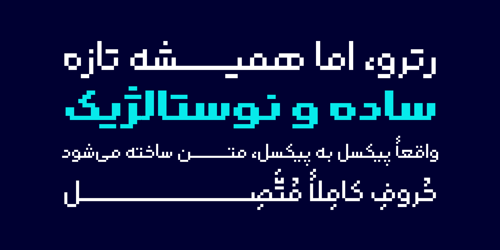

# Rooyin Free | رویین آزاد

فونت رویین به زودی منتشر خواهد شد.

فونت رویین تلاشی است برای زنده کردن زیبایی هنر پیکسلی در قالب نوشتار.
طراحی فونتی که هم حال‌وهوای فونت‌های پیکسلی را منتقل کند و هم در خوانایی زبان فارسی خللی ایجاد نکند، کاری دشوار و تقریباً ناممکن است؛ اما رویین این چالش را به سرانجام رسانده است. ساختار این فونت با الهام از فونت‌های نوین فارسی شکل گرفته و در عین وفاداری به سبک پیکسلی، حسی مدرن و امروزی را به متن می‌بخشد.
رویین آزاد در دو وزن و دو استایل نقطه طراحی شده و از زبان‌های فارسی، عربی، کُردی، تُرکی و اردو پشتیبانی می‌کند.

<li><a href="https://www.fontiran.com/rooyin">صفحۀ اصلی پروژه</a></li>
<li><a href="https://github.com/MohamadDarvishi/Rooyin/blob/main/CHANGELOG.md">فهرست تغییرات</a></li>